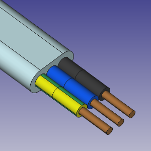
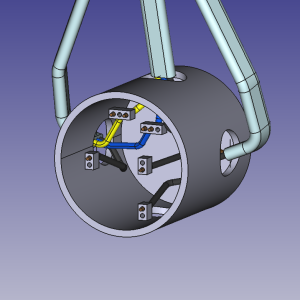
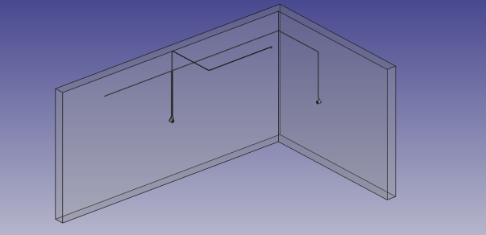

# FreeCAD Cables Workbench

Electrical cables drawing tools workbench for [FreeCAD](https://freecad.org)

 

## The goal and idea
The Cables Workbench has the following goals:

1. Creation and use of ready-made elements and cable profiles for modeling electrical installations in architectural design projects
2. Simplification of cable drawing in architectural models with the possibility of easy changes (like repositioning wall sockets or ligt switches with cables attached to them)
3. Enable quick and easy connection of single wires if that detail level is needed (e.g. connecting wires to connectors in electrical boxes or swichboards)
4. To be compatible with [BIM Workbench](https://wiki.freecad.org/BIM_Workbench)

The main idea of modeling cables (which are flexible in nature) as a static 3D elements is based on Wire Flex objects.
These objects are modified  [Draft Wire](https://wiki.freecad.org/Draft_Wire) objects with additional features like the possibility of attaching any Wire Flex vertices to external objects. This allows to automatically change the cable shape and length while changing the placement of external elements like boxes, switches, light points, walls, ceilings etc.

All elements (cables, boxes, connectors etc.) in this workbench are  [Arch Component](https://wiki.freecad.org/Arch_Component) elements. The cable element is based on [Arch Pipe](https://wiki.freecad.org/Arch_Pipe) class.

## Wiki
This workbench has a documentation which is a part of FreeCAD Wiki: [Cables Workbench Wiki](https://wiki.freecad.org/Cables_Workbench).

You can also install the workbench and see [examples](https://github.com/sargo-devel/Cables/tree/master/examples) to have a closer look into details. These files contain Info text with some additional hints.

## Installation
This workbench can be installed via the [Addon Manager](https://github.com/FreeCAD/FreeCAD-addons) (for details see [Addon Manager Wiki](https://wiki.freecad.org/Std_AddonMgr)).

It can also be installed manually by copying its entire `Cables/` folder to the FreeCAD local `Mod/` folder. Details: [Installing more workbenches](https://wiki.freecad.org/Installing_more_workbenches).

### Note
This workbench is currently at the alpha stage. You can expect some bugs which can make your model broken.
Some properties of models can change in the future and break models created with current version.

### Compatibility
Cables Workbench was created for [FreeCAD](https://freecad.org) version 1.0.0. No compatibility checks with previous versions were made.

### Contributions
Any code contributions are welcome. Please add all of your pull requests to the dev branch.

### References
* Development repo: https://github.com/sargo-devel/Cables
* FreeCAD Forum announcement/discussion [thread](https://forum.freecad.org/viewtopic.php?t=94090)
* Authors: [@SargoDevel](https://github.com/sargo-devel)

### Translations
It is possible to translate Cables Workbench. See [here](https://github.com/sargo-devel/Cables/tree/master/freecad/cables/resources/translations/README.md) for details.

Available translations:

* German
  * translator: [@maxwxyz](https://github.com/maxwxyz)
* Polish
  * translators: @kaktus, @mgr_wojtal, @Piter
* Spanish
  * translator: [@hasecilu](https://github.com/hasecilu)

Big thanks to the translators for their work!

### Release notes:
* v0.1.3  27 Feb 2025:  Minor fixes and corrections, code prepared for translation
* v0.1.2  25 Jan 2025:  Added profile selection
* v0.1.1  21 Jan 2025:  Fixed cable rotation problem
* v0.1.0  21 Jan 2025:  Initial version

## License
LGPLv3 (see [LICENSE](LICENSE))
